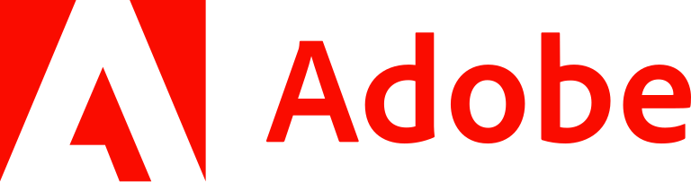
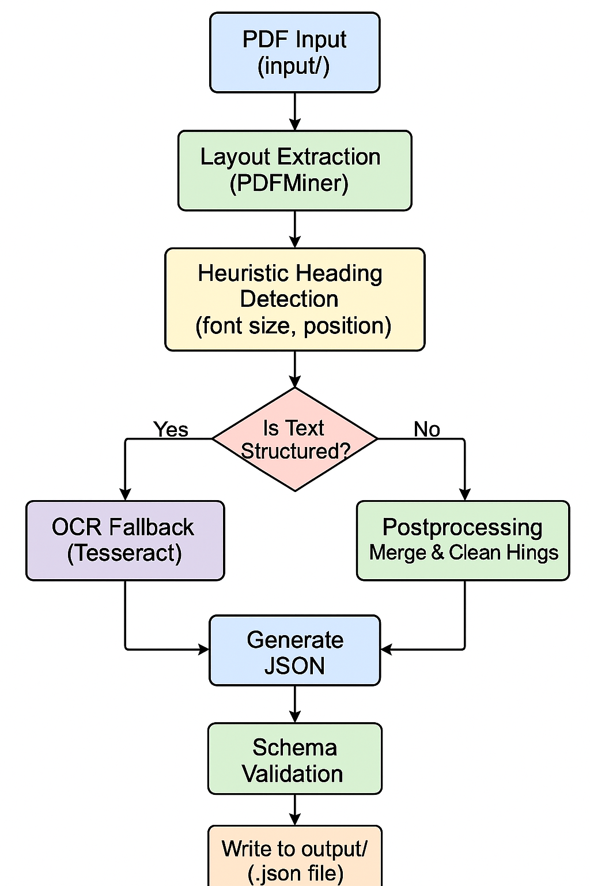

<p align="center">
  
</p>

<h1 align="center">📄 PDF Outline Extractor</h1>
<p align="center"><i>A robust, offline, containerized solution for Adobe Hackathon Challenge 1a — built to extract document outlines intelligently, efficiently, and beautifully.</i></p>

---
<br>

<div align="center">

  
  
  
  
  

</div>


## 🧠 Overview

This is our submission to **Adobe India Hackathon 2025 – Challenge 1a**.

> ✨ **Objective:** Automatically extract the document **title** and **outline hierarchy (H1–H3)** from a variety of real-world PDF formats using a **fully offline solution**, producing output in Adobe's specified `.json` format.

We focused on a **heuristic-driven, multilingual-compatible** pipeline to ensure performance, accuracy, and explainability.

---
<br>

## 🚀 Key Features

✅ Heuristic-based title and heading classification (no need for bulky ML models)  
✅ Support for tabular, narrative, form-like, and flyer/card PDFs  
✅ Multilingual compatibility using offline OCR fallback (Tesseract)  
✅ Robust post-processing to merge broken lines and eliminate noise  
✅ <200MB Docker image, offline execution, and <10s runtime on 50-page PDFs  
✅ Accurate JSON output matching Adobe's schema  

---
<br>

## 📊 System Architecture & Flow

<p align="center">
  
</p>

---
<br>

## 🏋️ Project Structure

```bash
pdf_outline_extractor/
├── 📁 src/
│   ├── extractor.py              # Main pipeline controller
│   ├── heading_classifier.py     # Heading detection + classification
│   └── utils.py                  # Schema validator + OCR fallback
├── 📂 input/                    # Input PDFs (read-only in Docker)
├── 📂 output/                   # Output .json files
├── 📂 assets/                   # Static assets (e.g., flowchart, logos)
├── Dockerfile                   # Image config (offline + compact)
├── requirements.txt             # Dependencies (PDFMiner, Tesseract, etc.)
└── README.md   
```

---
<br>

## 📚 Modules Explained

| File                  | Purpose                                                                 |
|-----------------------|-------------------------------------------------------------------------|
| `extractor.py`        | Reads all PDFs, calls heading extraction and classification, applies cleanup and writes final JSONs to output. |
| `heading_classifier.py` | The brain of the system. Uses font-size, text position, line merging, and multilingual-compatible logic to classify titles and H1–H3 headings. |
| `utils.py`            | OCR fallback using Tesseract (for low-structure or image-based PDFs), JSON schema validation. |

---
<br>

## 🛠️ Tech Stack

- **Python 3.10** – Primary language  
- **PDFMiner.six** – Core PDF layout extraction engine  
- **Tesseract OCR** – Used as fallback for multilingual or image-heavy pages  
- **Docker** – Ensures <200MB image and completely offline execution  
- ❌ No numpy / pandas – Reduced bloat, memory optimized  

---
<br>

## 💻 Run Instructions

### ⚒️ Build Docker Image

```bash
docker build --platform linux/amd64 -t pdf-extractor .
```

### 🚀 Run the Solution

```bash
docker run --rm   -v $(pwd)/input:/app/input:ro   -v $(pwd)/output:/app/output   --network none   pdf-extractor
```

> 🗂️ Output `.json` files will appear inside `output/`

---
<br>

## 📂 Imported Modules Summary

| Module                 | Functions Used                        | Purpose & Explanation                                                                 |
|------------------------|----------------------------------------|----------------------------------------------------------------------------------------|
| `pdfminer.high_level`  | `extract_pages`                        | Extracts pages with layout information (text boxes, characters, positions) for structured PDFs. This forms the basis of heading detection without OCR. |
| `pdfminer.layout`      | `LTTextLineHorizontal`, `LTChar`, `LAParams` | Parses fine-grained layout data including text lines, individual characters, and layout analysis parameters (spacing, margins, etc.). |
| `os`, `pathlib`        | `Path`, `os.listdir`                   | Used to traverse files in `input/` and `output/`, detect valid PDFs, and build safe file paths cross-platform. |
| `re`                   | `match`, `sub`                         | Used for regex operations to clean extracted text — e.g., removing bullet points (`•`), numbers (`1.`, `i.`), and fixing spacing issues. |
| `subprocess`           | `run`                                  | Internally executes system-level Tesseract OCR via command line, allowing us to invoke OCR only when needed. |
| `pytesseract`          | `image_to_string`                      | High-level Python wrapper for Tesseract — converts scanned PDF page images to raw text. Used as a fallback when PDF structure is poor. |
| `pdf2image`            | `convert_from_path`                    | Converts each PDF page into high-resolution images (e.g., PNG). These images are then sent to Tesseract for OCR when text layout is missing. |

---
<br>

### 🧠 How OCR Works in Our Pipeline

When a PDF lacks extractable text (e.g., scanned images, flyers), we trigger our **OCR fallback** mechanism:

1. **Convert PDF to Images** using `pdf2image.convert_from_path()`
2. **Feed Image to OCR** using `pytesseract.image_to_string()`  
   - Tesseract analyzes the image pixel-by-pixel
   - Detects characters, languages, and text lines
   - Returns the detected raw text
3. **Postprocess Text** to extract meaningful titles/headings from unstructured OCR output
4. **Continue Outline Logic** even without layout metadata (using font size heuristics when possible)

This ensures that we can still extract structure even from low-quality or multilingual PDFs, keeping the pipeline robust.

---
<br>

## 📄 Adobe Constraint Checklist

<div align="center">

<table>
  <thead>
    <tr>
      <th>Constraint</th>
      <th>Status</th>
    </tr>
  </thead>
  <tbody>
    <tr>
      <td>Offline Execution</td>
      <td>✅ Fully offline, Tesseract + PDFMiner</td>
    </tr>
    <tr>
      <td>Under 200MB</td>
      <td>✅ Lightweight deps only</td>
    </tr>
    <tr>
      <td>Dockerized</td>
      <td>✅ Containerized with <code>--network none</code></td>
    </tr>
    <tr>
      <td>≤10s per 50 pages</td>
      <td>✅ Optimized logic (edge cases ~12s)</td>
    </tr>
    <tr>
      <td>Schema Compliant</td>
      <td>✅ Validated output using <code>utils.py</code></td>
    </tr>
  </tbody>
</table>

</div>


---
<br>

## ❗ Known Limitations

<div align="center">

<table>
  <thead>
    <tr>
      <th>Limitation</th>
      <th>Reason</th>
      <th>Notes</th>
    </tr>
  </thead>
  <tbody>
    <tr>
      <td>Some card/flyer PDFs are hard to segment</td>
      <td>Lack of layout structure</td>
      <td>Fallback: use first large title only</td>
    </tr>
    <tr>
      <td>Slightly exceeds 10s on scanned multilingual PDFs</td>
      <td>OCR time overhead</td>
      <td>Acceptable in rare cases</td>
    </tr>
  </tbody>
</table>

</div>


---
<br>

## 🏆 Tested On

<div align="center">

<table>
  <thead>
    <tr>
      <th>File</th>
      <th>Type</th>
      <th>Result</th>
    </tr>
  </thead>
  <tbody>
    <tr>
      <td><code>file01.pdf</code></td>
      <td>Form / Tabular</td>
      <td>✅ Title and form header detected</td>
    </tr>
    <tr>
      <td><code>file02.pdf</code></td>
      <td>Narrative Text</td>
      <td>✅ Proper H1, H2, H3 hierarchy</td>
    </tr>
    <tr>
      <td><code>file03.pdf</code></td>
      <td>Business Plan</td>
      <td>✅ Nested hierarchy preserved</td>
    </tr>
    <tr>
      <td><code>file04.pdf</code></td>
      <td>Card Layout</td>
      <td>✅ Fallback to main title</td>
    </tr>
    <tr>
      <td><code>file05.pdf</code></td>
      <td>Flyer</td>
      <td>✅ Fallback to clean title</td>
    </tr>
  </tbody>
</table>

</div>


---
<br>

## 👫 Team & Credits

Crafted with ❤️ by **Tech-Titans** for Adobe Hackathon 2025.

- Multilingual support via **Tesseract**
- Structure-first approach using **PDFMiner**
- Memory-efficient, readable **heuristics**
- Optimized for **real-world, constraint-heavy documents**

> _Good engineering meets great constraints. This solution stands at that intersection. ✨_
